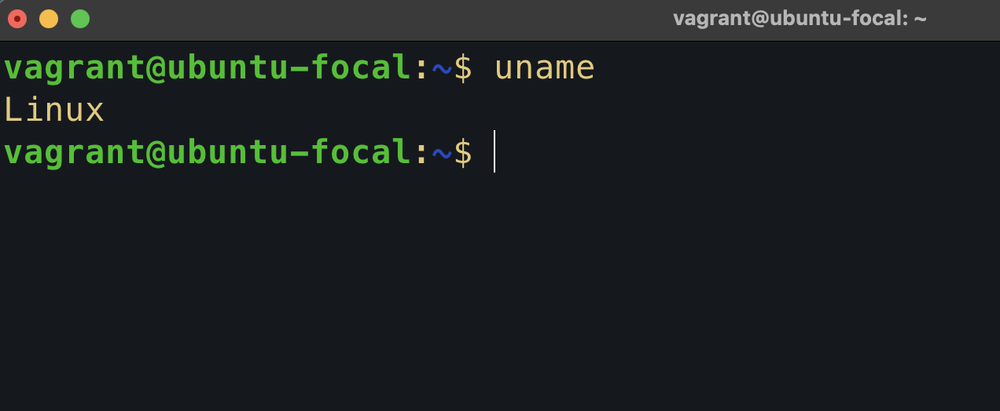

# Linux Commands Research - Exercise 2

For this exercise, I researched 10 additional Linux commands not covered in the module.  
I created a folder in my `altschool-cloud-exercises` project containing:

- A markdown file explaining each command briefly.
- Usage examples for each command.
- Screenshots demonstrating each command in action.

All images are embedded in the markdown files to provide clear visual references.  
This submission showcases my understanding and practical usage of these Linux commands.

### 1. `uname`

**Description:**  
Show system information

### 2. `whoammi`

**Description:**  
Show the current logged-in username

### 3. `date`

**Description:**  
Displays or set the system date and time

### 4. `uptime`

**Description:**  
Show how long the system has been running

### 5. `df`

**Description:**  
Display disk space usage of file systems

### 6. `du`

**Description:**  
Show disk usage of files and directories.

### 7. `ps`

**Description:**  
Show current running processes

### 8. `kill`

**Description:**  
Send a signal to a process (usually to terminate it)

### 9. `head`

**Description:**  
Display the first lines of a file

### 10. `tail`

**Description:**  
Send a signal to a process (usually to terminate it)

