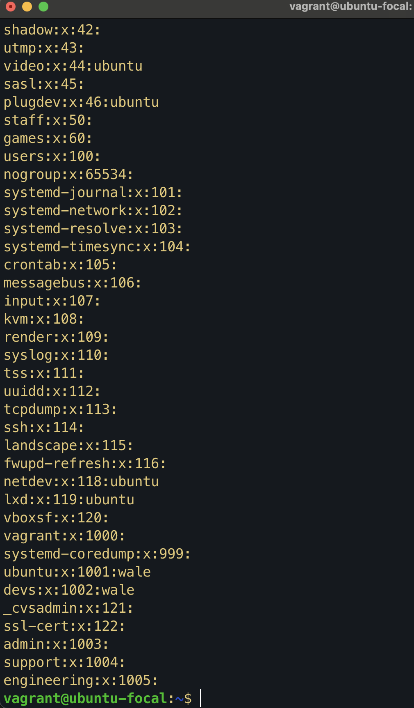
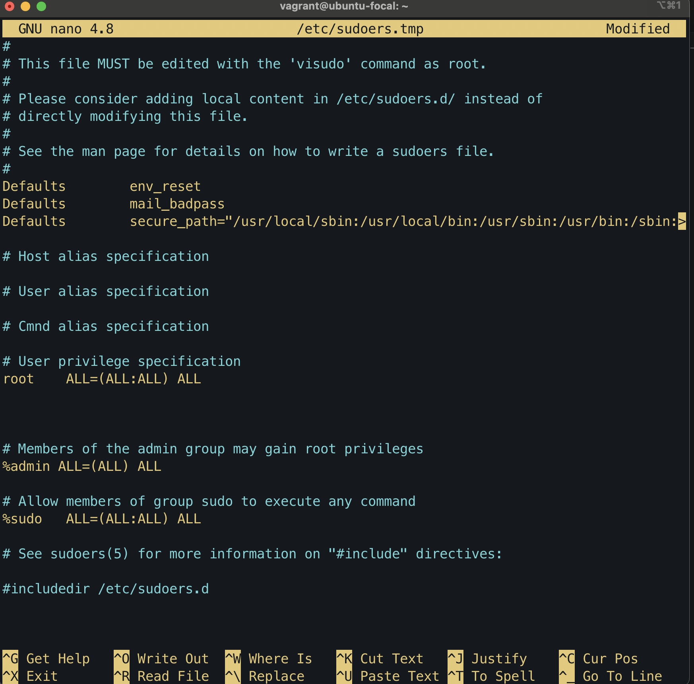
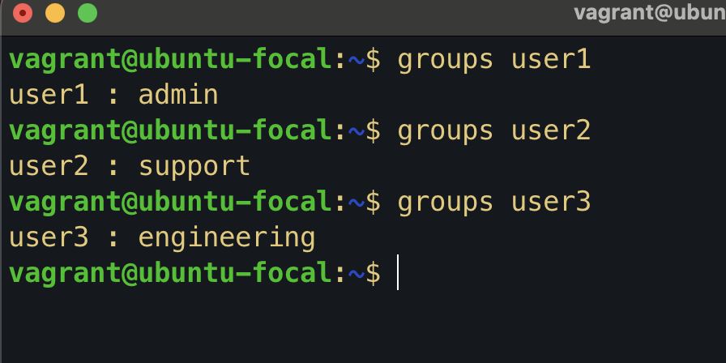
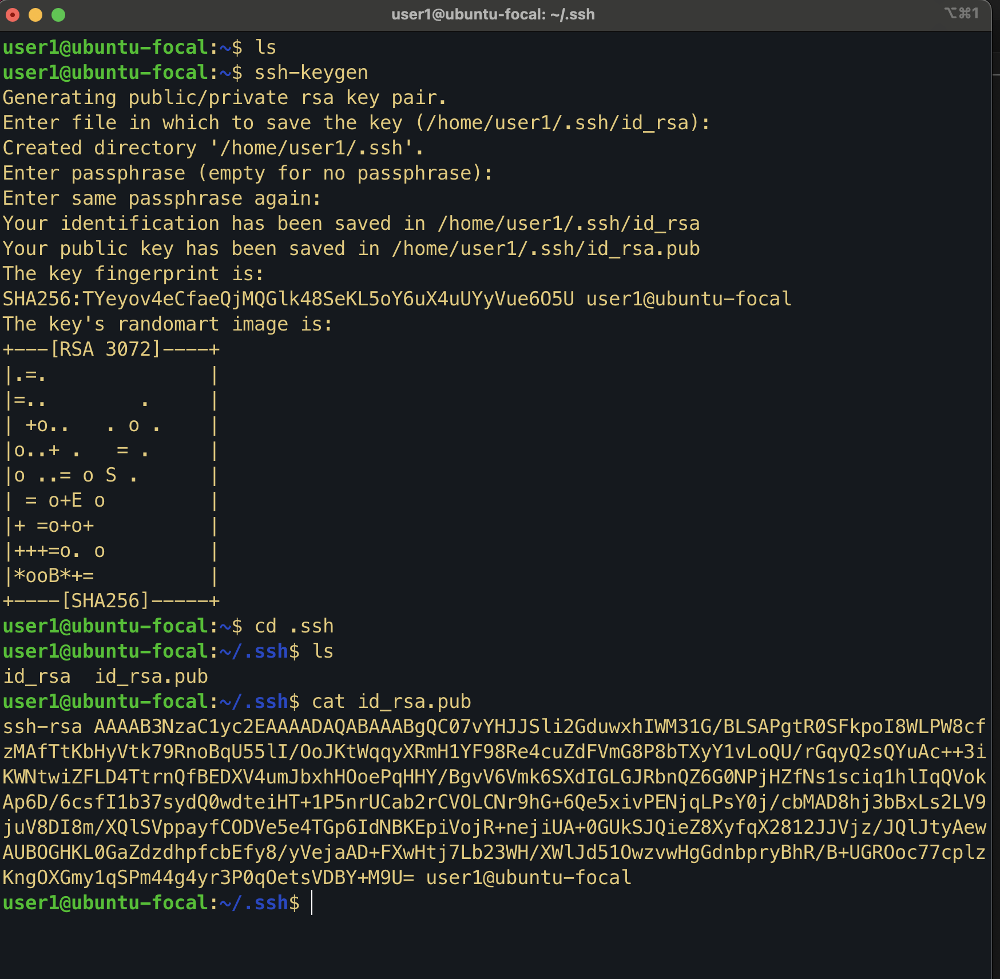

# User and Group Setup - Exercise 3

## Steps Taken

1. Created groups:

```bash
sudo groupadd admin
sudo groupadd support
sudo groupadd engineering
```



2. Added admin group to sudoers:

```bash
sudo vi sudo
"%admin ALL=(ALL)"
```



3. Created users and assigned to groups:

```bash
   sudo useradd -m -g admin user1
   sudo useradd -m -g support user2
   sudo useradd -m -g engineering user3
```



4. Generated SSH keys for the admin user:

```bash
sudo su - user1
ssh-keygen

```


