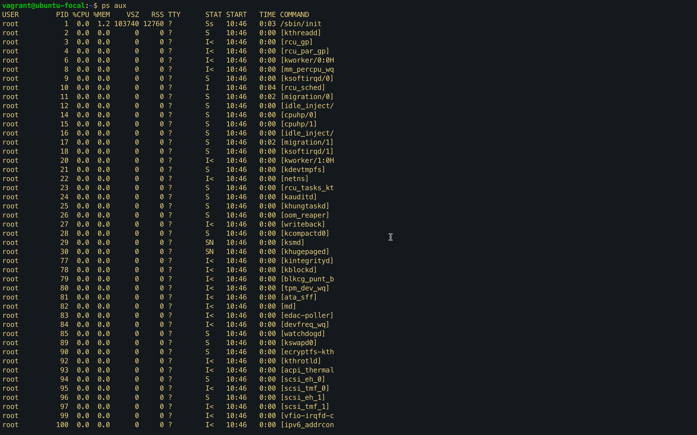
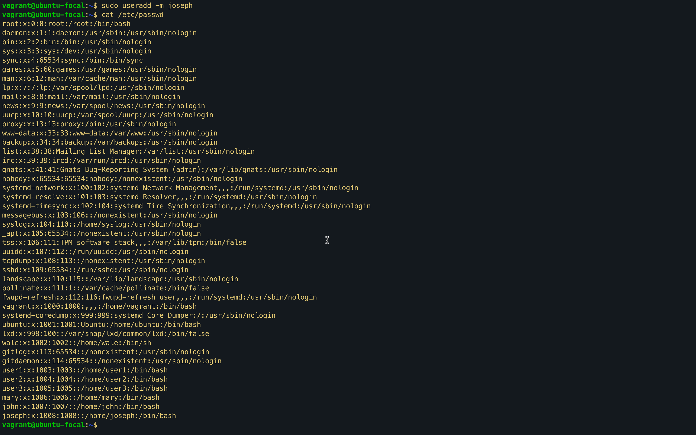
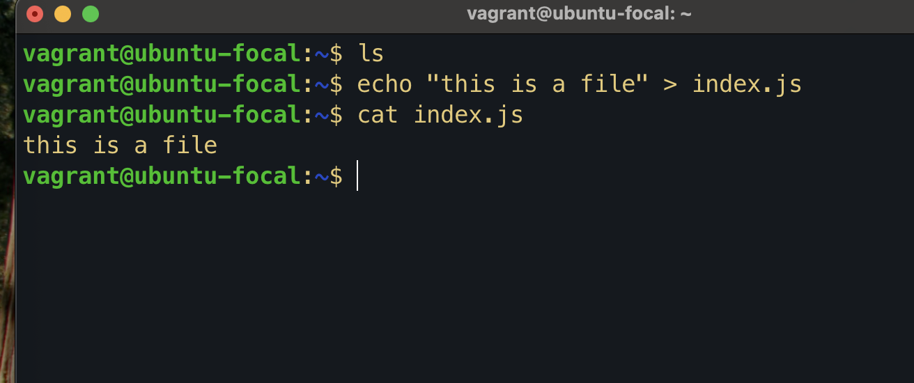
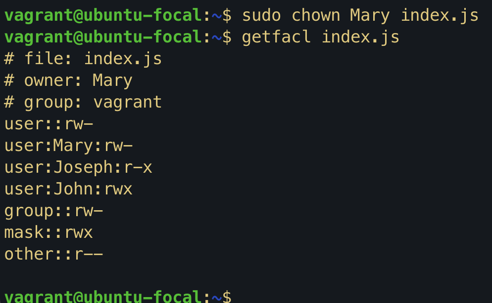

# Process Checking - Exercise 4.1

---

## Task

1. Find out the command for checking running processes on your terminal.
2. List any five processes you see and explain what they do for your system.
3. Give your opinion on whether they are important processes.

---

## What I Did

- Used the command `ps aux` to display all running processes on the system.
- Reviewed the list to identify five distinct processes.
- Explained their function and importance to the system.

---

## Solution

| Process                | PID(s)            | Description                                                                                 | Importance                                                   |
| ---------------------- | ----------------- | ------------------------------------------------------------------------------------------- | ------------------------------------------------------------ |
| `/sbin/init`           | PID 1             | The first process started by the kernel; initializes the system and starts other processes. | **Critical** – If it stops, the system will go down.         |
| `/usr/bin/dbus-daemon` | PID 618           | Handles inter-process communication for desktop/system services.                            | **Important** – Needed for services to communicate.          |
| `/usr/sbin/sshd`       | PID 707, 11266    | Secure Shell daemon allowing remote login access.                                           | **Important** – Needed for remote SSH access.                |
| `/usr/sbin/apache2`    | PID 739, 740, 741 | Web server hosting websites or services.                                                    | **Optional/Important** – Depends if web services are needed. |
| `ps aux`               | PID 22429         | The command itself used to list all processes.                                              | **Not critical** – A utility to view running processes.      |

---

## Summary

The command `ps aux` is very useful for viewing all running processes on a system. The listed processes include core system daemons like `init` and `dbus-daemon`, which are vital for system stability and inter-service communication. The `sshd` process is important for remote management. The web server `apache2` is essential only if hosting web services. Finally, the `ps aux` command itself is just a tool for monitoring.

---



# Linux User and File Permission - Exercise 4.2

## Objective

Create three users — Mary, Joseph, and John — on a Linux system, create a file named `index.js`, and assign different permissions (Read, Write, Execute) to each user on this file.

---

## Steps Taken

1. **Created users:**

```bash
sudo useradd Mary
sudo useradd Joseph
sudo useradd John
```



2. **Created the file index.js with placeholder content:**

```bash

   echo "This is a file" > index.js
```



3. **Set up file ownership and permissions:**

```bash
sudo chown Mary index.js

```



4. **Set permissions for each user:**

```bash
sudo setfacl u:username:permission index.js

```


