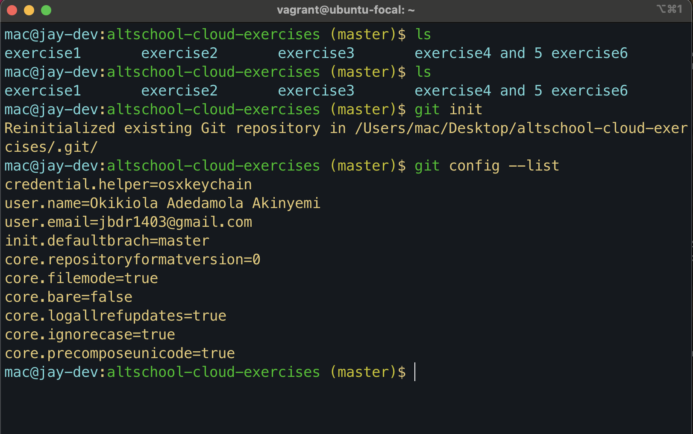
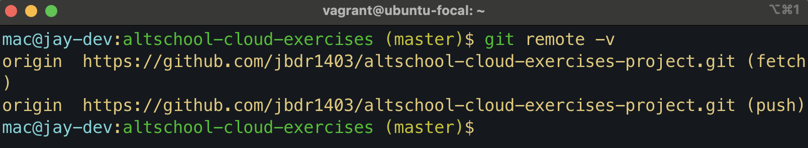
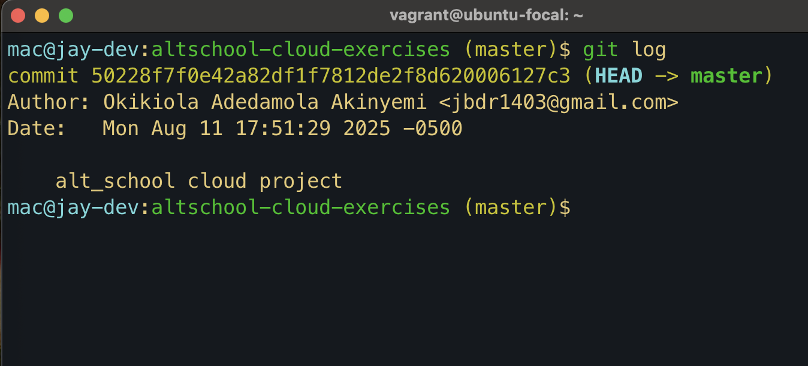

# Git and GitLab Setup Assignment - Exercise 6

---

## Steps Taken

1. **Configured Git global username and email:**

```bash
git config --global user.name "Your Name"
git config --global user.email "your.email@example.com"

```

**git config -l**



View remote repositories:

```bash
git remote -v
```



Display commit history:

```bash

git log

```


