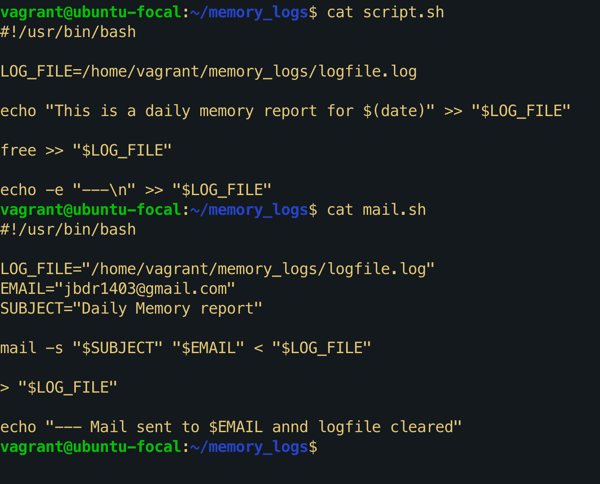

# Bash Scripting and Crontab - Exercise 8

---

## Details

**After installing postfix and mail utils, I configured the postfix /main.cf and /sass_passwd to point to gmail, then i proceeded to write my main script and mail script:**

**Then I proceeded to edit the crontab with "crontab -e"**

**Final Output of the email**

